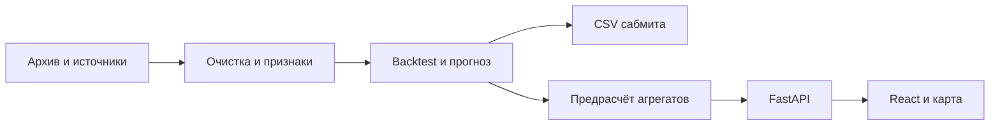

# План хакатона Прогноз загрузки трамвайных маршрутов Москвы

**Версия:** 25 сентября 2026, МСК. **Команда:** DS‑1, DS‑2, fullstack. **Срок из кейса:** 27 сентября, 23:59 МСК. На платформе проверить актуальность дедлайна. Основание: приложенные `требованич.docx` (главный при конфликте), два файла ответов экспертов и PDF «ИИ-прогноз загрузки трамвайных маршрутов».

## 1. Что строим и что сдаём

«Трамвайный пульс» — экран оперативного диспетчера: карта маршрутов Москвы, прогноз **числа валидаций** на каждый час, список пиков/аномалий, развёртка конкретного маршрута без потери выбора, сценарные поправки и выгрузка. Название «загрузка» в продукте поясняется как оценка по валидациям: без достоверной вместимости и данных о высадках нельзя выдавать количество пассажиров внутри вагона за измеренный факт.

Два независимых результата:

1. **Data Science:** CSV с точной сеткой и форматом `sample_submission` за ноябрь–декабрь 2025; лучший результат за всё время идёт в зачёт. Из ответов экспертов: train январь–август, test сентябрь–октябрь; значения ноября–декабря отсутствуют, лидерборд на всём периоде, скрытой части нет. Ежедневный лимит по PDF: 36 попыток всего, 24 успешных. Пятый ошибочный маршрут **оставить** в CSV; допустимы нули или оценка, решение после локальной проверки. WAPE-score = `max(0, 1 − sum(abs(y−ŷ))/sum(y))`, выше лучше. Порог 0,88 даёт максимальные 10 баллов по таблице кейса, но фактический score нельзя обещать.
2. **Продукт:** Docker/Docker Compose, REST API, React/TypeScript, карта, день с почасовой детализацией, неделя и месяц по дням, фильтры маршрута/остановки/участка при наличии маппинга, экспорт CSV, простая авторизация; README с запуском, архитектурой, областью применения и честно измеренной производительностью. Год — необязательная демонстрационная оценка с явно низкой уверенностью, длинный расчёт асинхронный.

PDF оценивает также источники данных (до 4 баллов при ссылке и доказанном эффекте), область применимости/адаптации (до 2), сценарные коэффициенты и воспроизводимый пайплайн (до 2), архитектуру/скорость (до 5), функциональность (до 4), бизнес-пользу (до 2), питч (до 10). Не гнаться за годом до готовности основных сценариев.

## 2. Порядок источников и решения при конфликте

| Вопрос | Решение команды | Основание |
|---|---|---|
| Приоритет | `требованич.docx` → Q&A экспертов → PDF | указание владельца проекта |
| Горизонты | час в сутках; неделя по дням; месяц по дням; год как эксперимент | требованич; Q&A поясняет, что год не обязателен |
| Прогноз без новых фактов | единая непрерывная сетка ноября–декабря; признаки из истории и известных будущих календарных факторов; собственные лаги только при контроле накопления ошибки | Q&A экспертов |
| Ночные валидации | отделить технологические транзакции вне времени работы от пассажирского потока; не удалять до сверки расписания | требованич |
| Пробои данных | отличать нулевой спрос от сбоя получения; показать флаг качества и контролируемое восстановление по аналогичным периодам | требованич |
| Геодетализация | остановка/участок только если есть достоверная привязка; иначе в UI явно показывать «оценка маршрута», не псевдоточные значения по остановке | PDF + границы данных |
| Интерфейс | тёмная рабочая поверхность, однозначная цветовая индикация, крупные номера маршрутов, быстрый переход общий вид → маршрут → неделя с сохранением объекта | требованич |
| Внешние факты после 31.10.2025 | разрешены для конкурсного режима по Q&A; честный сценарий работы на дату среза оценивать отдельно | Q&A экспертов |

## 3. Распределение работы и сдаваемые результаты

### DS‑1 — прогноз и CSV (владелец метрики)

1. Получить архив организаторов `https://disk.yandex.ru/d/DiFwlfMOauxjBg`, прочитать описание и `sample_submission`, зафиксировать точные поля/таймзону/ключ уникальности. Сохранить исходный sample локально. Публично — только схема и агрегированные статистики.
2. Построить временную сетку маршрут × дата × час для всех строк sample, считать WAPE на полном пересечении без пропусков, проверить `sum(y)>0`, округление/обрезку неотрицательных значений и отдельное решение по маршруту 5.
3. Разбить доступные месяцы по времени: обучать на январе–августе, валидировать на сентябре–октябре; добавить последовательный backtest с более ранними срезами. Не перемешивать часы и не использовать целевые значения будущего через лаги/агрегаты.
4. Baseline: медиана/среднее по `route × day_of_week × hour`, смягчение на редких сегментах; затем LightGBM/CatBoost или HistGradientBoosting с календарём, трендом, погодой и качеством данных. Проверить direct horizon и рекурсивные лаги: в 61-дневном прогнозе лаги обновляются **только предсказаниями**, иначе утечка.
5. Протоколировать WAPE по маршрутам, дневным/ночным часам, месяцам и пиковым часам; сравнить baseline и новую модель. При ухудшении использовать baseline. Финальный адаптер загружает sample, заполняет только прогнозную колонку, сохраняет порядок, типы и таймстемпы, проверяет отсутствие NaN/inf и дубликатов.
6. Сдать `ml/forecast`, `ml/submit`, параметры, версию модели, воспроизводимую команду, CSV и скрин результата загрузки/ссылку на попытку. Отдельно экспорт предрассчитанных прогнозов для API.

**Готово, когда:** локальная метрика воспроизводима одной командой; CSV проходит проверки и платформу; модель не зависит от неизвестных в целевой дате фактов в честном режиме.

### DS‑2 — качество данных, внешние факторы и область применения

1. Изучить описание архива, проверить ключи маршрута/времени, таймзону, дубликаты, коды успешной валидации, отрицательные/аномальные значения, расписание движения и процент пропусков. `transfer`/хэш платёжного средства не считать числом пассажиров; считать допустимые валидации. Хэши пассажиров не переносить в модель/репозиторий без нужды.
2. Собрать регулярную сетку и флаги `observed`, `true_zero`, `suspected_outage`, `outside_service`, `imputed`. Диагностика пробоя: длинные нули одного маршрута при работе транспорта и сопоставимом поведении соседних дней/маршрутов; не восстанавливать все нули автоматически. Для восстановления обучить оценку на искусственно скрытых блоках, сравнить с оставлением пропуска и измерить влияние на WAPE DS‑1.
3. Подготовить признаки погоды и календаря, исследовать трафик, ремонты и события по [реестру источников](DATA_SOURCES.md). На каждый действительно используемый источник: **конкретная ссылка/способ получения**, лицензия, покрытие, лаг доступности и ablation на одном временном срезе. Источник без доказанного улучшения оставить исследованием, не обещать балл.
4. Согласовать с fullstack маршрутную геометрию и ID остановок/участков; составить список покрытых маршрутов, пропущенных дат и условий переноса модели. Подготовить 2–3 честные демонстрационные аномалии и объяснение неопределённости.
5. Сдать `ml/data`, `ml/features`, таблицу качества, код получения внешних данных, журнал ablation и раздел ограничений. В `PROJECT_STATE.md` записать точные контракты.

**Готово, когда:** путь от исходных строк до почасовой цели повторяем, нули и пробои различаются, каждая заявленная внешняя переменная имеет ссылку и измеренный эффект.

### Fullstack — диспетчерский сервис, демонстрация, сборка

1. В тот же день утвердить OpenAPI и локальный mock JSON, чтобы UI делался параллельно с ML. Согласовать контракты `route_id`, `timestamp_msk`, `bucket`, `pred_validations`, `quality_flag`, `model_version`.
2. Backend на **Python 3.12+ / FastAPI**, офлайновый импорт предсказаний в индексированную SQLite (или DuckDB/Parquet для подготовки), быстрые запросы к уже рассчитанным агрегатам. Не обучать модель в HTTP-запросе. Статический React 19+/TypeScript 5+ bundle обслуживать через тот же контейнер для простого Compose.
3. API: `GET /api/routes`, `/api/overview?date=`, `/api/forecast?route_id=&from=&to=&bucket=hour|day`, `GET /api/export.csv`, `/api/health`, авторизация. Ошибки 400/404/503 с понятным русским сообщением; OpenAPI `/docs`. Корректирующие коэффициенты на погоду/событие/сезон в UI показывают сценарий поверх базового прогноза и **не** меняют конкурсный CSV.
4. Простая авторизация: один/несколько демонстрационных пользователей, логин и хэш пароля в отдельном локальном файле, монтируемом в контейнер только для чтения (`secrets/users.json`, Argon2/bcrypt). Секрет сессии в переменной окружения/секрете, никакого пароля или демонстрационного токена в Git. Добавить `.example` без настоящих значений.
5. Реализовать карту, фильтры, график и сплит видов по разделу 4; экспорт выбранного среза. При отсутствии геометрии показать список/график и честную плашку покрытия карты, не рисовать придуманные остановки.
6. Dockerfile и Compose, `README` с одной командой запуска, маленькие обезличенные fixtures для жюри, healthcheck. Прогнать нагрузку по двум типовым endpoints на **одном контейнере 2–4 vCPU/2–4 ГБ**; записать инструмент, объём данных, параллелизм, p50/p95, RPS, CPU и RSS. Ориентир PDF — сотни RPS и p95 200–300 мс, это критерий, не достигнутый факт.

**Готово, когда:** новый человек запускает сервис по README, входит с выданными отдельно учётными данными, переключает маршрут и временную шкалу, скачивает CSV, видит статус качества и не получает ошибку на демо.

**Координатор:** любой из трёх; ведёт `PROJECT_STATE.md`, подачу CSV, форму сдачи, ссылки, 5-минутный питч и 5-минутные ответы. Это работа по очереди, не четвёртая роль.

## 4. Интерфейс и дизайн

Основной desktop 1440×900; на 1366×768 все главные действия без горизонтального скролла, на планшете панели складываются вертикально. Тёмный графитовый фон (`#111820`), спокойные поверхности (`#1C2731`), светлый текст (`#F0F4F6`), один яркий акцент для выбранного маршрута. Цвет загрузки — последовательная шкала от бирюзового через янтарный к красному, одновременно подписи и числа: цвет не единственный носитель смысла. Серый штрих означает «нет данных», а не нулевой спрос.

```text
Верх:  [Трамвайный пульс] [Дата/час] [День | Неделя | Месяц] [Экспорт] [Пользователь]
Слева: список маршрутов, поиск, число валидаций, пик, статус качества
Центр: карта Москвы и выделенный маршрут/остановки с легендой
Справа: график по часам/дням, факт vs прогноз где факт доступен,
        карточка пика, причины/факторы, переключатели сценарных поправок
Низ:   временная лента и выбранный интервал, источник/версия модели
```

Сценарии: (а) диспетчер видит все маршруты выбранного дня, кликает строку/линию один раз и сразу получает маршрут с тем же временем; (б) переключает «неделя», сохраняя маршрут и положение на карте; (в) выбирает остановку только при наличии проверенной привязки; (г) включает поправку «осадки +20%» как сценарий и видит разницу **от базового прогноза**, затем сбрасывает; (д) экспортирует тот же срез. Номера маршрутов крупные при любом зуме; управление слева и справа от рабочей области, важные действия не прячутся в меню. Убрать декоративные анимации и вспышки белого.

Подпись графика: «Прогноз валидаций, чел. в час» использовать осторожно: одна валидация не всегда равна уникальному человеку. Лучше «валидаций/час». Если вместимость неизвестна, не писать «салон заполнен на 92%»; отображать относительно собственного исторического порога маршрута и пояснять метод.

## 5. Архитектура и контракт



Часовые предсказания всегда первичны. День/неделя/месяц — **суммы тех же часов**, поэтому цифры в CSV, API и интерфейсе согласованы. Геопривязка к остановкам требует отдельной модели/распределения и качества; не делить сумму маршрута поровну по остановкам. Время хранить как timezone-aware `Europe/Moscow`, в API явно ISO 8601 с `+03:00`; границы интервала `[from, to)`.

Пример контракта ответа, уточнить по реальному датасету:

```json
{"route_id":"7","bucket":"hour","from":"2025-11-01T07:00:00+03:00","to":"2025-11-01T08:00:00+03:00","pred_validations":142,"quality":"forecast","model_version":"baseline-1","source_mode":"competition"}
```

Сценарный ответ отдельным полем `scenario_pred_validations`, чтобы экспорт базового прогноза не подменялся пользовательской поправкой. Рассчитывать коэффициенты в пределах разумных диапазонов, обозначить, что это гипотеза оператора, не переобученный прогноз. Задача года при необходимости: `POST /api/forecast-jobs` → job id → `GET /api/forecast-jobs/{id}`; предрасчёт или фоновый процесс, не блокировать UI.

## 6. Календарь до дедлайна

| МСК | DS‑1 | DS‑2 | Fullstack | Общее решение |
|---|---|---|---|---|
| 25.09 ночь | инспекция sample, baseline | аудит полей и пробелов | wireframe, OpenAPI, mock | назначить роли, контракты, GitHub |
| 26.09 утро | первый backtest и CSV | очистка, погода и календарь | UI обзор/маршрут, login | контрольная интеграция №1 |
| 26.09 вечер | модель и первая платформа | ablation и пределы | API, карта, экспорт, Compose | записать первый score, принять источники |
| 27.09 утро | лучшие 1–2 варианта, финальный CSV | журнал качества и ссылки | интеграция реальных прогнозов, тест запуска | заморозить контракт, питч |
| 27.09 день | проверка sample/сабмит | ограничения/адаптация | нагрузочный замер и README | 5-минутный прогон, форма сдачи |
| до 27.09 23:59 | лучший CSV уже отправлен | ссылки на источники | работающее демо и инструкции | проверить обе обязательные загрузки |

Резерв: после 27.09 18:00 не начинать рискованные модели и большие переделки UI; оставить время на воспроизводимость, ссылки и подачу. PDF говорит, что DS CSV и форма материалов — **две отдельные** загрузки; в зачёт CSV лучший, у формы сохраняется последняя версия.

## 7. Организация GitHub и ИИ-агентов

Рабочий репозиторий: [`Dianka678/mthack-tram`](https://github.com/Dianka678/mthack-tram). Личный репозиторий GitHub даёт приглашённым участникам `anastshalim` и `emergreq` права записи (Write); роль Admin доступна для репозитория организации после переноса. Участники принимают приглашения и отдельно предоставляют своим ИИ-инструментам доступ к репозиторию через настройки их GitHub-интеграций. В Settings → Rules/Rulesets защитить основную ветку: PR, один review, запрет force push, требовать CI после его добавления. Если ограничения тарифного плана не позволяют правило, команда всё равно работает только через PR. Включить Issues; метки `ds1`, `ds2`, `fullstack`, `blocked`, `integration`, `submission`.

Порядок команд у каждого после создания репозитория:

```bash
git clone https://github.com/Dianka678/mthack-tram.git
cd mthack-tram
git checkout -b ds1/baseline             # имя ветки меняется по роли и задаче
# изменить файлы; проверить локально; обновить свою строку в PROJECT_STATE.md
git add .
git commit -m "feat(ds1): add reproducible baseline"
git push -u origin ds1/baseline
# открыть Pull Request на main через интерфейс GitHub
```

Один агент получает в задаче **Issue + разрешённые каталоги + вход/выход + критерии готовности**. Шаблон промпта: «Прочитай `AGENTS.md`, `PROJECT_STATE.md` и Issue #N. Работай в ветке `ROLE/task`. Не меняй чужой контракт. Реализуй только X, запусти Y, открой PR с фактическими результатами и поправь свою строку в общем файле». Для независимых задач агенты работают параллельно в отдельных ветках; для контрактов и merge — последовательно через review. Не выдавать нескольким агентам одну ветку и один файл без координации. При конфликте `PROJECT_STATE.md` вручную сохранить обе записи, затем обновить статус после merge. Основные решения фиксировать в `main`, а не в чате отдельного агента.

Граница ИИ: агент может писать код/тесты/документацию и открывать PR; человек принимает модель, проверяет источники, реальные метрики, секреты, стоимость облака и отправку на платформу. Все версии модели имеют hash артефакта и команду воспроизведения. Для задач UI можно выдать mock JSON заранее; DS‑1 и DS‑2 согласуют сетку до обучения.

## 8. Запуск и проверка

После реализации проекта локальная целевая команда: `docker compose up --build -d`, затем `docker compose ps`, `curl -f http://localhost:8000/api/health`, открыть `http://localhost:8000`. `secrets/users.json` создаётся **локально** из документированного шаблона и монтируется read-only. Сервис должен показывать версию модели и дату прогноза, работать с обезличенным fixture без исходного архива для жюри. Не заявлять работоспособность команды до фактического запуска.

Проверки: точное число строк и порядок sample, полные 61 день × требуемая сетка, никаких NaN, целые неотрицательные прогнозы, отсутствие дублей, сохранение маршрута 5; агрегация час→день→месяц без расхождений; API login/ошибки/экспорт; карта/плашка качества; повторный запуск Compose на чистой машине; нагрузочный тест. README содержит команду нагрузки (например `hey` или `k6`), параметры машины/контейнера и таблицу **измеренных** RPS/p95/CPU/RAM. Не переносить целевые сотни RPS как результат.

## 9. Yandex Cloud и вариант без него

**Самый быстрый путь:** локальное обучение и Docker Compose; публичный демо-хост нужен только если платформа требует открытый URL. При наличии действующего гранта/кредита Yandex Cloud использовать одну небольшую VM с 2–4 vCPU/4 ГБ, Ubuntu, Docker и Compose, без Managed PostgreSQL/ GPU. Предрассчитанный прогноз и SQLite экономят память и не требуют постоянно работающей ML-инференс-службы. Ресурсы VM оплачиваются, даже когда никто не открывает страницу; цену и остаток гранта проверить в собственной консоли/калькуляторе перед созданием.

Последовательность: (1) в Billing проверить привязанный аккаунт, остаток гранта, включить уведомление о бюджете; уведомление — **не автоматический жёсткий стоп**; (2) создать отдельную папку `mthack-demo`, VM и минимальные права, открыть только 22 для своего IP и 80/443 для демо; (3) доставить **собранный образ/код без исходных данных** и секрет локальным защищённым каналом; (4) настроить HTTPS через домен/реверс-прокси, создать файл логина/хэша пароля на VM вне git, `docker compose up -d --build`; (5) проверить внешнюю ссылку, login, карту, экспорт и health; (6) после сдачи выключить/удалить VM, диск и публичный IP, если они больше не нужны. Никогда не публиковать пароли и приватные данные в образе.

Официальные инструкции: [создание платёжного аккаунта](https://yandex.cloud/en/docs/billing/quickstart/), [уведомления о бюджете](https://yandex.cloud/en/docs/billing/operations/budgets), [калькулятор](https://yandex.cloud/ru/prices), [бесплатные лимиты serverless](https://yandex.cloud/en/docs/billing/concepts/serverless-free-tier). Serverless Containers можно рассматривать позднее для разделённых служб, но для демонстрации Compose в одном узле VM проще. Managed PostgreSQL имеет отдельную стоимость; ставить его без доказанной необходимости не надо. Локальный вариант сохраняет все артефакты и инструкции, но не даёт постоянно доступного внешнего URL: в форме тогда уточнить требования организаторов к ссылке на запускаемый сервис.

## 10. Сдача и питч

В форме указать: (1) код обучения/инференса и модели с README; (2) точные URL всех заявленных внешних данных; (3) ссылку на запускаемый сервис/репозиторий с Compose и входом для жюри, пароль передать способом, который разрешает платформа, отдельно от Git; (4) схему архитектуры, покрытие маршрутов/периодов и адаптацию; (5) измеренные RPS/p95/CPU/RAM и дополнительные функции; (6) ограничения и развитие. Отдельно загрузить валидный CSV в Data Science до дедлайна. Пять минут питча: 40 с проблема и целевая величина, 90 с качество/срезы/источники, 90 с живое демо общего вида→маршрут→неделя→поправка→CSV, 40 с архитектура и измерения, 20 с ограничения. Подготовить ответы про пятый маршрут, пробои, экстраполяцию на 61 день, отличие валидаций от заполненности и временную доступность погоды.

## 11. Что нельзя подтвердить без архива и аккаунтов

Точная схема, список маршрутов и остановок, лицензия на данные, результат WAPE, эффект внешних источников, скорость сервиса, размер облачного гранта и запуск репозитория/демо пока неизвестны. После получения `dataset.zip` и доступа в GitHub обновить `PROJECT_STATE.md`, заменить черновые контракты фактическими и проверить обе загрузки на платформе.
